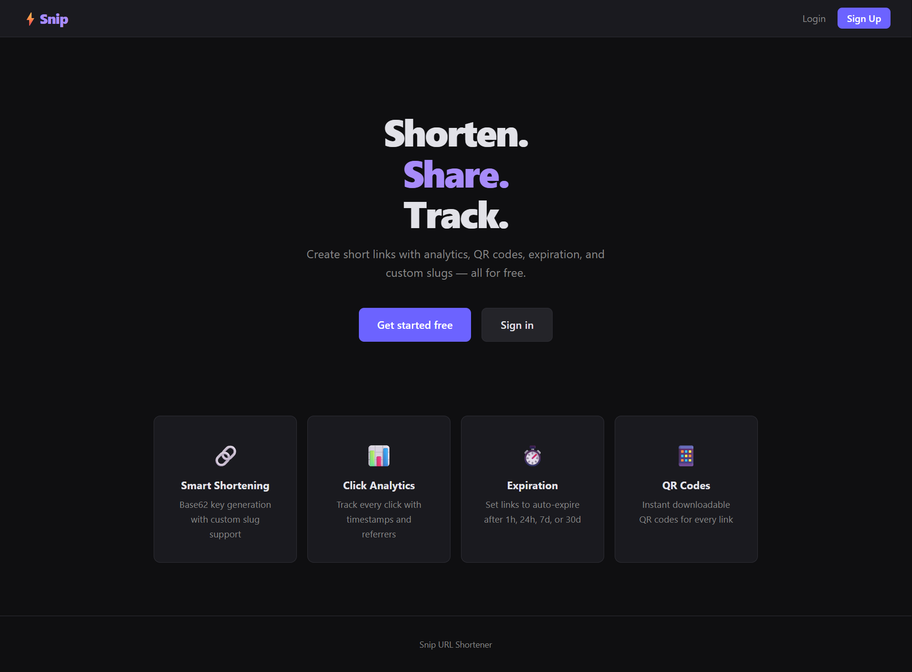
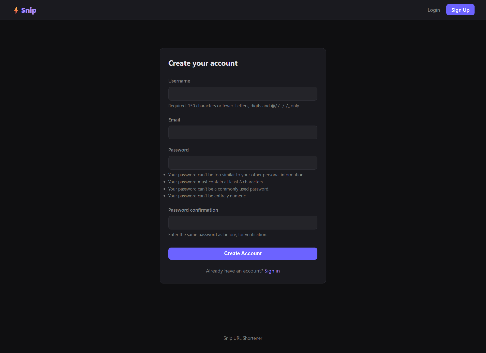
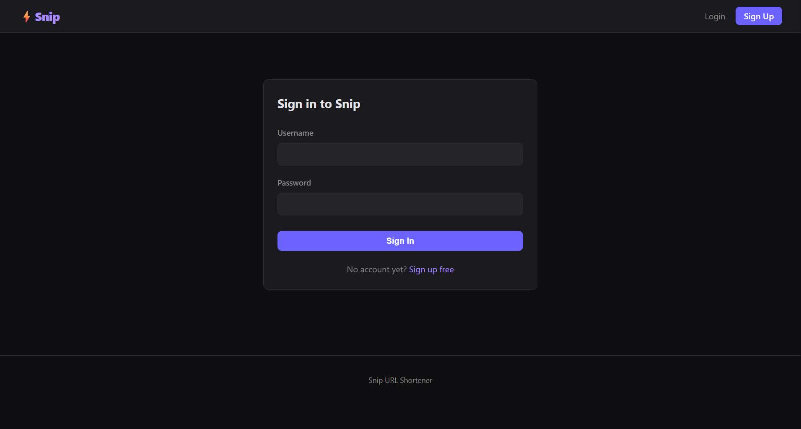
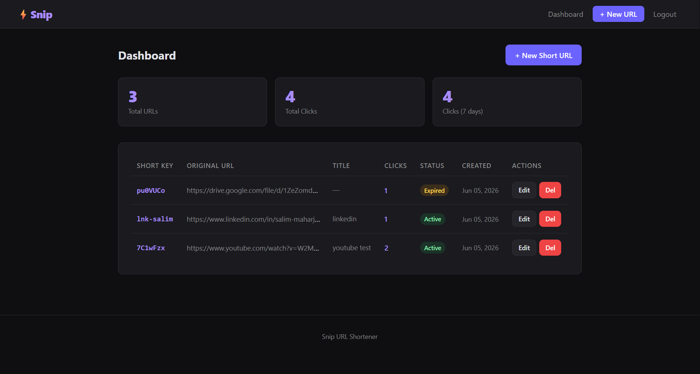
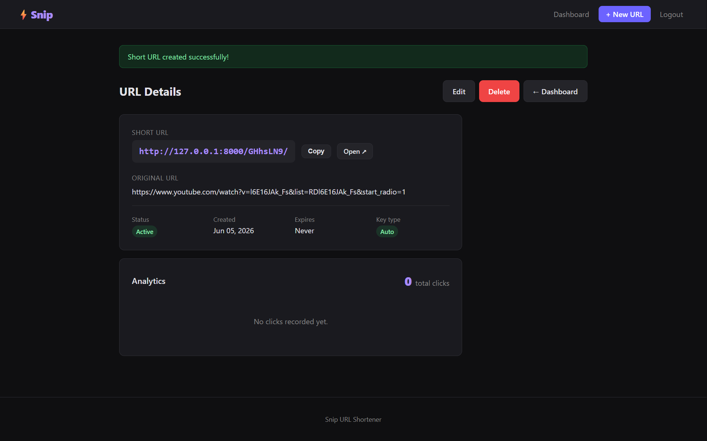
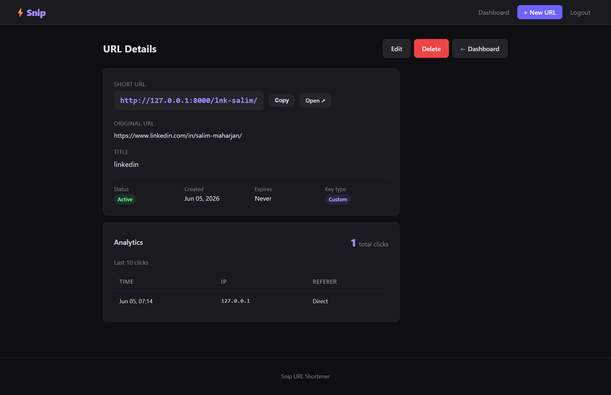

# ⚡ Snip — URL Shortener

A full-featured URL shortener web application built with **Python** and **Django**. Created as part of an internship interview task.

---

## 📸 Screenshots

### Landing Page


### Register


### Login


### Dashboard


### Create Short URL


### URL Detail 


### Delete Confirmation


---

## ✅ Features

### Core Requirements
| Feature | Status |
|---|---|
| User Registration & Login | ✅ |
| Only authenticated users can create URLs | ✅ |
| Base62 short key generation | ✅ |
| Short URL redirects to original | ✅ |
| View all your short URLs | ✅ |
| Edit existing URLs | ✅ |
| Delete URLs | ✅ |
| Click count analytics | ✅ |
| Per-click log (IP, timestamp, referer) | ✅ |
| Responsive UI | ✅ |

### Bonus Features
| Feature | Status |
|---|---|
| Custom short keys | ✅ |
| URL expiration (1h / 24h / 7d / 30d) | ✅ |

---

## 🛠 Tech Stack

- **Backend** — Python 3, Django 4.2
- **Database** — SQLite (dev) / PostgreSQL (prod)
- **Frontend** — Django Templates, plain HTML/CSS (dark theme, responsive)

---

## 🚀 Getting Started

### Prerequisites
- Python 3.10 or higher
- pip

### Installation

```bash
# 1. Clone the repository
git clone https://github.com/salim-mhrzn/snip-url-shortener.git
cd url

# 2. Create and activate a virtual environment
python -m venv venv

source venv/bin/activate      # macOS / Linux
venv\Scripts\activate         # Windows

# 3. Install dependencies
pip install -r requirements.txt

# 4. Apply database migrations
python manage.py migrate

# 5. (Optional) Create an admin superuser
python manage.py createsuperuser

# 6. Run the development server
python manage.py runserver
```

Open **http://127.0.0.1:8000** in your browser.

---

## 📦 Dependencies

```
Django>=4.2
Pillow>=10.0
```

---

## 📁 Project Structure

```
snip-url-shortener/
├── manage.py
├── requirements.txt
├── README.md
├── urlshortener/               # Project configuration
│   ├── settings.py
│   ├── urls.py
│   └── wsgi.py
├── shortener/                  # Main application
│   ├── models.py               # ShortURL, ClickEvent models
│   ├── views.py                # All view logic
│   ├── forms.py                # Registration, create/edit forms
│   ├── admin.py                # Django admin setup
│   └── migrations/
└── templates/                  # HTML templates
    ├── base.html               # Shared layout & styles
    ├── index.html              # Landing page
    ├── register.html
    ├── login.html
    ├── dashboard.html          # URL list + stats
    ├── create_url.html
    ├── url_detail.html         # Analytics + QR code
    ├── edit_url.html
    └── delete_url.html
```

---

## 🔑 How It Works

### Short Key Generation
```python
BASE62_CHARS = string.ascii_letters + string.digits  # a-z A-Z 0-9

def generate_short_key(length=7):
    return ''.join(random.choices(BASE62_CHARS, k=length))
```
Picks 7 random characters from 62 possible = **62⁷ ≈ 3.5 trillion** unique combinations. A collision check re-generates the key if it already exists in the database.

### Redirect Flow
```
User visits /aB3xK9p/
    → Look up short_key in database
    → Check if active and not expired
    → Record ClickEvent (IP, timestamp, referer)
    → Increment click_count
    → 302 redirect to original URL
```

---

## 🔐 Admin Panel

Access the Django admin panel at **http://127.0.0.1:8000/admin/**

Log in with your superuser credentials to view and manage all users, URLs, and click events.

---

## ⚙️ Production Checklist

Before deploying to a live server:

- [ ] Set `DEBUG = False` in `settings.py`
- [ ] Set a strong random `SECRET_KEY` via environment variable
- [ ] Update `ALLOWED_HOSTS` with your domain
- [ ] Switch to PostgreSQL
- [ ] Serve static/media files via nginx or a CDN
- [ ] Enable HTTPS

---

## 📄 License

This project was built for an internship interview assignment.
